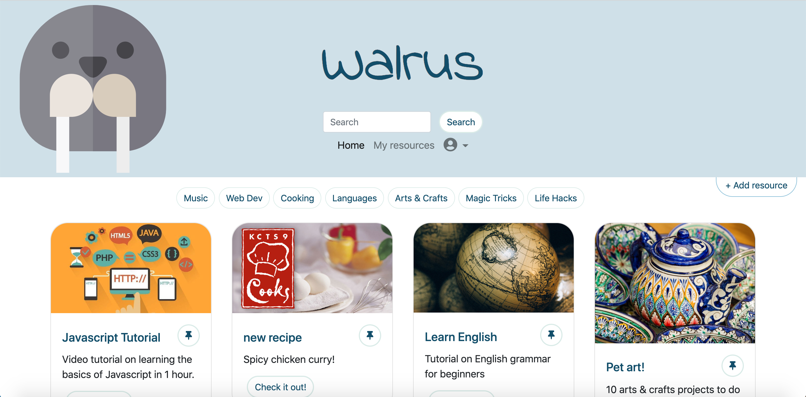
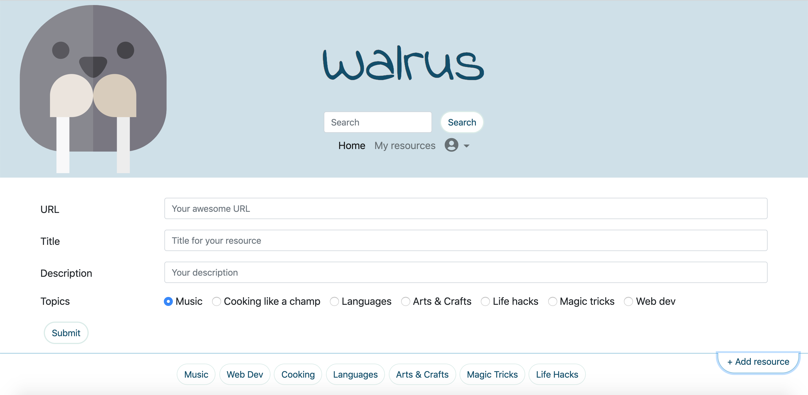
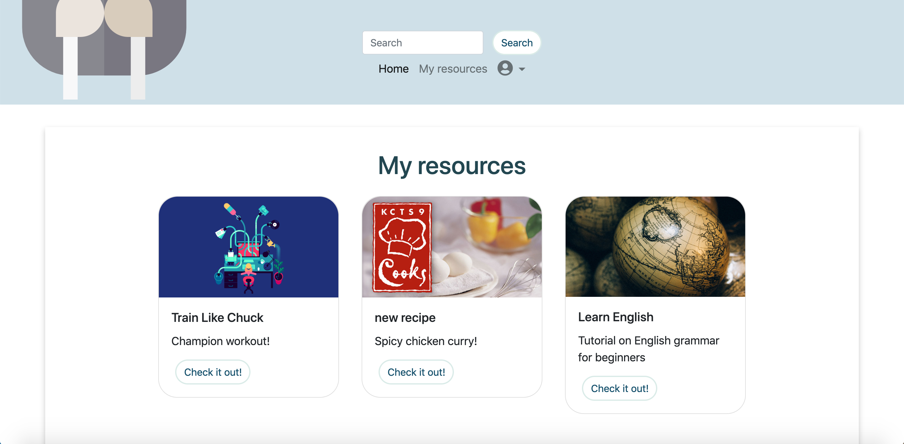
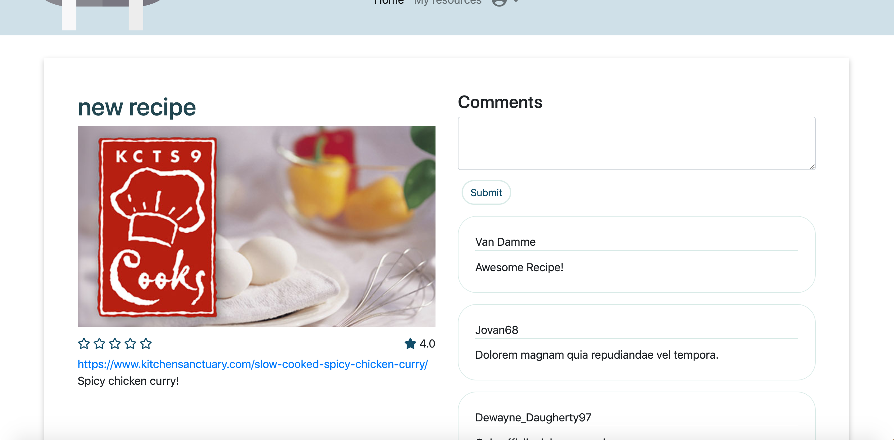
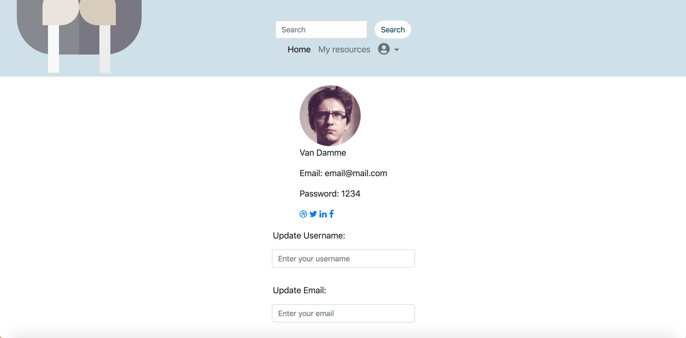
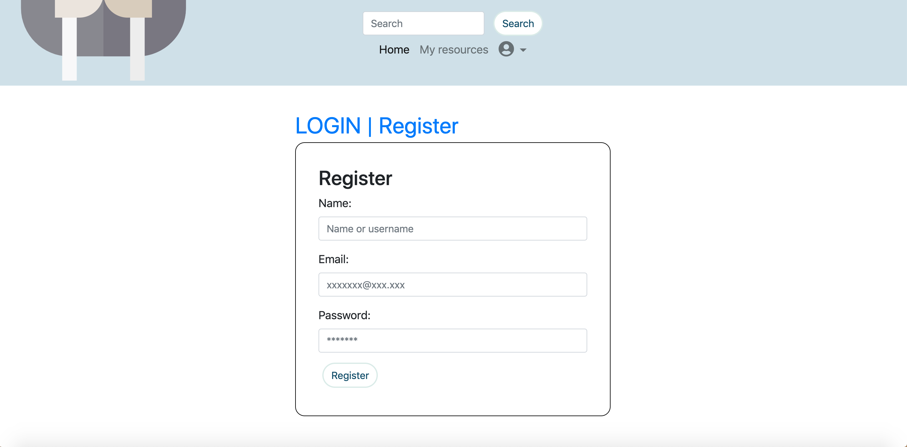
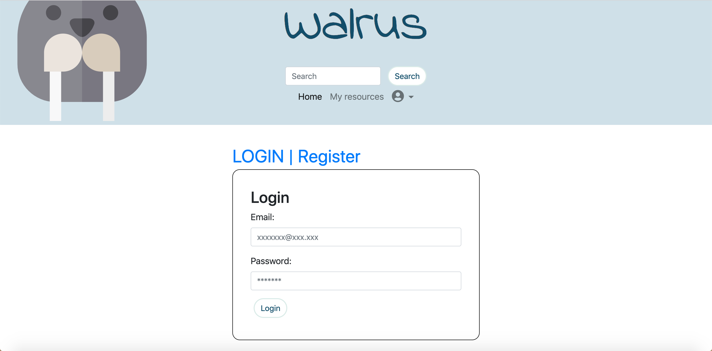

# Walrus

## Project Description

Welcome to Walrus! This is  where you can browse a wall full of resources on a variety of topics from learning a foreign language to checkout magic tricks. Now you can create what you want to work with inspirations you just found!

Please register for an account and log in to be able to use Walrus.

## Screen Shots

## Running the App

1. Install dependencies: `npm i`
2. Fix to binaries for sass: `npm rebuild node-sass`
3. Run migrations: `npm run knex migrate:latest`
  - Check the migrations folder to see what gets created in the DB
4. Run the seed: `npm run knex seed:run`
  - Check the seeds file to see what gets seeded in the DB
    (You might want to do this multiple times to sucessfully insert data to the database)
5. Run the server: `npm run local`
6. Visit `http://localhost:8080/`

## Dependencies

- Node 5.10.x or above
- NPM 3.8.x or above
- body-parser: 1.15.2
- cookie-parser: 1.4.4
- dotenv: 2.0.0
- ejs: 2.4.1
- express: 4.13.4
- faker: 4.1.0
- jquery-bar-rating: 1.2.2
- knex: 0.11.7
- knex-logger: 0.1.0
- morgan: 1.7.0
- node-sass-middleware: 0.9.8
- pg: 6.0.2
